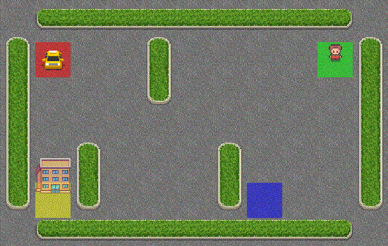
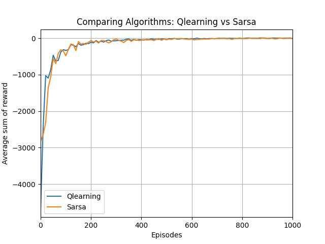
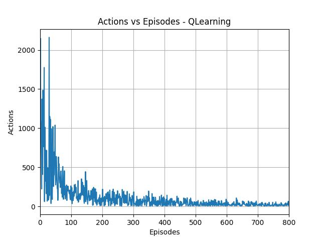
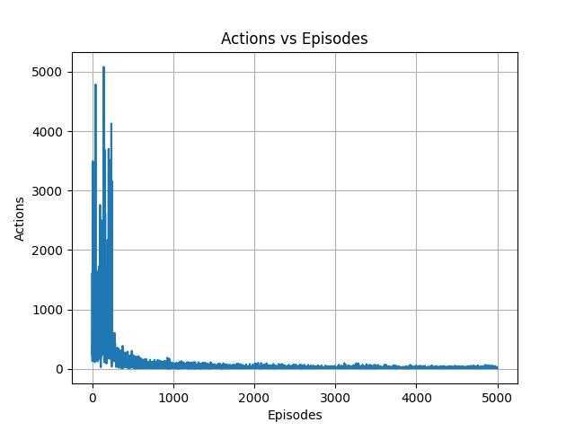
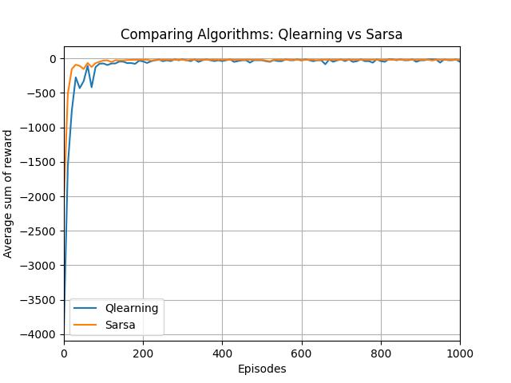

<div align='center'>
  <h3>
    Q-learning 🆚️ Sarsa Algorithm 
  </h3>
</div>


O objetivo do projeto é a comparação entre o desempenho de dois algorítimos muito utilizados em Reinforcement Learning, o [QLearning](https://www.simplilearn.com/tutorials/machine-learning-tutorial/what-is-q-learning) e o [Sarsa](https://towardsdatascience.com/reinforcement-learning-with-sarsa-a-good-alternative-to-q-learning-algorithm-bf35b209e1c). Para demonstrar os diferentes desempenhos, utilizou-se dois ambientes implementados pela biblioteca `gym`, o [TaxiDriver](https://www.gymlibrary.dev/environments/toy_text/taxi/) e o [Cliff Walking](https://www.gymlibrary.dev/environments/toy_text/cliff_walking/)

### Configurações ⚙️

Instale as bibliotecas necessárias utilizando o comando:

```bash

pip install -r requirements.txt

```

Para rodar o projeto siga o padrão:

```bash

python main.py <ambiente> <algoritimo> <reuse_data>

```

Onde:

- **ambiente** : 'taxi' ou 'cliff'. 

Ambiente onde o algorítimo ocorrerá.

- **algoritimo**: 'q' ou 'sarsa' ou 'both' . 

Algorítimo que será utilizado para resolver o problema. 

Caso a opção 'both' seja escolhida, ambos os algorítimos rodaram e um gráfico de sem desempenho comaprativo será criado, caso utilizado essa opção, **reuse_data = 0** necessariamente.

- **reuse_data** : '0' ou '1'. 

Utilizar ou não um csv existente como valor da **q_table**. 

### TaxiDriver - Desempenho 🚕️

<div align='center'>
  
</div>

Analisando  o gráfico de comparação abaixo, que representa o número médio de rewards por episódio de treino, parece que ambos os algorítimos (qlearning e sarsa) possiem uma taxa de aprendizagem e comportamento semelhante. Porém, analizando a quantidade de ações realizadas para chegarmos a solução do problema, é possível chegar a conclusão que o **algorítimo Sarsa** nem sempre consegue o caminho ótimo ate o seu destino, tendo que tomar , muitas vezes, um número de ações maior do que o **algorítimo QLearning**.

<div align='center'>
  
  
  
</div>


### Cliff Walking - Desempenho 🧙‍♂️️

<div align='center'>
  
</div>

Novamente, o comportamento do gráfico de comparação que leva em conta número médio de rewards por episódio de treino, parece bem semelhante para ambos os algorítimos (QLearning e Sarsa). Porém, observa-se também para esse ambiente que o algorítimo Sarsa não realiza o número mínimo de steps para realizar o seu objetivo, ou seja, não toma o camínho ótimo como solução, diferentemente do QLearning.

<div align='center'>
  
</div>

### QLearning vs  Sarsa - Vantagens e Desvantagens 📌️ 

- `QLearning`

Desenvolvimento da fórmula:
$$Q(S_t, A_t) = Q(S_t, A_t) + \alpha[R_{t+1} + \gamma max(Q(S_{t+1}, a)) - Q(S_t, A_t) ]$$

- `Sarsa`
Desenvolvimento da fórmula:
$$Q(S_t, A_t) = Q(S_t, A_t) + \alpha[R_{t+1} + \gamma Q(S_{t+1}, A_{t+1}) - Q(S_t, A_t) ]$$

